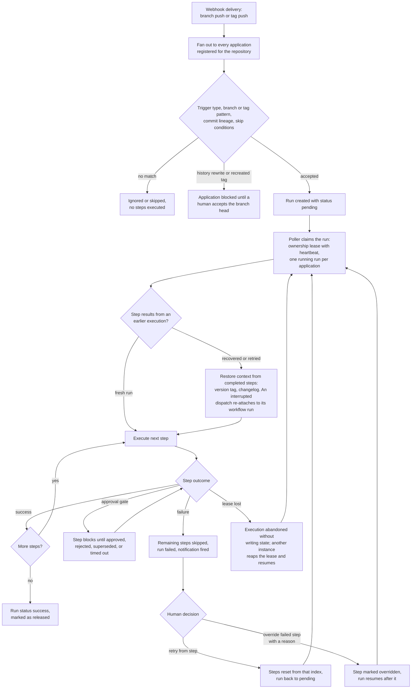

# bifrost

Self-hosted release orchestration tool. Watches GitHub, Gitea, and Forgejo repositories for branch pushes or tag pushes and runs configurable release pipelines: semantic versioning, changelog generation, tagging, releases, workflow dispatch, and manual approval gates.

Multiple applications can share a single repository (monorepo), each with its own path filters, pipeline, and tag prefix.

Bifrost ships as a single self-contained Go binary with the web UI embedded. In production there is one process on one port and no Node.js runtime: it serves the UI, the JSON API under `/api`, webhooks, health, and metrics.

## Quick start (development)

```bash
git clone https://github.com/marcelblijleven/bifrost
cd bifrost
cp .env.example .env   # fill in JWT_SECRET, API_KEY, and a GitHub token
make dev
```

`make dev` installs [air](https://github.com/air-verse/air) if needed, starts Postgres via Docker Compose, and launches the Go backend (hot reload) and Vite frontend simultaneously. Press **Ctrl+C** to stop everything.

- Frontend (open this): http://localhost:5173
- Backend: http://localhost:8080

The two-process split is development only: the Vite dev server proxies `/api` to the backend so the browser stays same-origin. A production build collapses both into the single `bin/bifrost` binary (see [Building](#building)).

On first visit you are redirected to `/setup` to create the admin account.

## Prerequisites

- [Go](https://go.dev/) 1.23+
- [Docker](https://www.docker.com/) + Docker Compose
- [Node.js](https://nodejs.org/) + [pnpm](https://pnpm.io/)

## Environment variables

| Variable | Required | Description |
|---|---|---|
| `DATABASE_URL` | Yes | PostgreSQL connection string |
| `JWT_SECRET` | Yes | 32+ char random string, e.g. `openssl rand -hex 32` |
| `API_KEY` | Yes | Static key for management API calls |
| `HTTP_ADDR` | No | Listen address (default `:8080`) |
| `PUBLIC_URL` | No | Externally reachable URL of this instance; required for the "Install webhook" button, and when it starts with `https://` session cookies are marked `Secure` |
| `GITHUB_TOKEN` | * | Personal access token (`repo` + `workflow` scopes) |
| `GITHUB_APP_ID` | * | GitHub App ID (takes priority over token) |
| `GITHUB_INSTALLATION_ID` | * | GitHub App installation ID |
| `GITHUB_PRIVATE_KEY` | * | GitHub App private key (PEM) |
| `GITHUB_BASE_URL` | No | GitHub Enterprise API base URL (default: github.com) |
| `GITHUB_UPLOAD_URL` | No | GitHub Enterprise upload URL |
| `GITEA_URL` | No | Gitea instance URL; enables the `gitea` provider |
| `GITEA_TOKEN` | No | Gitea access token |
| `FORGEJO_URL` | No | Forgejo instance URL; enables the `forgejo` provider |
| `FORGEJO_TOKEN` | No | Forgejo access token |

\* At least one provider must be configured. For GitHub that means `GITHUB_TOKEN` or the three `GITHUB_APP_*` vars.

## Make targets

| Target | Description |
|---|---|
| `make dev` | Hot-reload backend + frontend (main development command) |
| `make dev-backend` | Backend only with air hot reload |
| `make dev-frontend` | Frontend only (`pnpm dev`) |
| `make run` | Run the backend without hot reload |
| `make build` | Build `bin/bifrost` (builds and embeds the frontend) |
| `make build-server` | Build `bin/bifrost` without rebuilding the frontend |
| `make build-cli` | Build `bin/bifrost-cli` |
| `make test` | Run all Go tests |
| `make lint` | Run golangci-lint |
| `make docker-up` | Start Postgres container |
| `make docker-down` | Stop containers |
| `make docker-build` | Build the production Docker images locally (`VERSION=1.2.3` to stamp) |

## Building

`make build` compiles a single binary at `bin/bifrost` with the web UI embedded. It builds the frontend first (`frontend/build/`) and embeds it via `go:embed`, so the resulting binary is self-contained:

```bash
make build            # builds frontend + embeds it + compiles bin/bifrost
./bin/bifrost         # needs only the env vars below at runtime — no Node, no static files
```

The frontend and Go steps are decoupled for faster iteration:

- `make frontend-build` rebuilds only the embedded UI (`frontend/build/`).
- `make build-server` recompiles the binary against whatever is already in `frontend/build/`.

A committed `frontend/build/.gitkeep` lets `make build-server` (and CI's compile check) succeed before the UI has ever been built; that binary simply serves a "frontend not built" notice until you run a real build.

Deploy the binary anywhere with a `DATABASE_URL`: run it behind a TLS-terminating proxy pointed at port 8080. See the [Production deployment guide](frontend/src/lib/docs/deployment.md) for a systemd + nginx walkthrough.

## Triggers

Every application listens to exactly one trigger type, never both:

- **Push** (default): commits pushed to the tracked branch start a run. Skip conditions (commit message patterns, `paths_include`, `paths_ignore`) decide which pushes are relevant. Bifrost tracks the branch head across pushes; force pushes, history rewrites, and branch deletion block the application until a human accepts the new head.
- **Tag**: pushed tags matching a glob pattern (e.g. `v*` or `frontend-v*`) start a run. The tag itself provides the version, so the pipeline may not contain `semver` or `tag` steps. The tagged commit must be reachable from the application's branch. Each tag triggers at most one run; recreating a tag at a different commit blocks the application, just like a force push.

For monorepos, register one application per deliverable on the same repository: `paths_include` routes pushes to the right application, and a **tag prefix** keeps release tags apart (the `semver` step then produces `frontend-v1.2.3` style tags and ignores other applications' tags).

## Pipeline steps

| Step | Configuration | Description |
|---|---|---|
| `semver` | `v_prefix` | Determines the next version from git tags using Conventional Commits, scoped to the application's tag prefix |
| `changelog` | none | Generates a changelog entry from commits since the last released run, scoped to `paths_include` when set; used as the tag message and release description |
| `approval` | `message`, `timeout_hours` | Pauses for human approval via the UI |
| `tag` | none | Creates an annotated git tag at the release commit |
| `create_release` | `draft`, `prerelease` | Creates a GitHub, Gitea, or Forgejo release |
| `dispatch_workflow` | `workflow`, `wait`, `timeout_minutes`, `require_approval`, `approval_message`, `approval_timeout_hours` | Triggers a CI workflow (GitHub Actions or Gitea/Forgejo Actions) |
| `notify` | `url`, `headers` | POST webhook notification (non-fatal on failure) |

Example pipeline:

```json
[
  { "type": "semver" },
  { "type": "changelog" },
  { "type": "approval", "config": { "message": "Ready to ship?" } },
  { "type": "tag" },
  { "type": "create_release" },
  { "type": "dispatch_workflow", "config": { "workflow": "deploy.yml", "wait": true } },
  { "type": "notify", "config": { "url": "https://hooks.slack.com/..." } }
]
```

## How a run executes

A webhook delivery fans out to every application registered for the repository. Each application that accepts the event gets a pending run, which any live Bifrost instance can claim and execute. Steps run strictly in order; a failure stops the run but a human can retry or override to resume it.



Key properties:

- **At most one running run per application**, enforced across instances. Newer pushes queue behind the active run; approving a newer run supersedes older ones waiting on the same gate.
- **Crash safe**: a run's owner extends its lease with heartbeats. If an instance dies, any other instance reaps the expired lease and resumes the run from its last recorded step. Side-effectful steps are idempotent: an already-created tag or release at the expected commit counts as success, and a dispatched workflow is re-attached instead of dispatched twice.
- **Failures never auto-continue**: a failed step stops the run. Retrying re-executes from that step; overriding (with a mandatory reason, recorded for the audit trail) accepts the failure and resumes after it.

## CLI

```bash
make build-cli

# Interactive login (saves to ~/.config/bifrost/config.json)
./bin/bifrost-cli login

# Or use env vars in CI
export BIFROST_URL=https://bifrost.internal
export BIFROST_TOKEN=<token>

./bin/bifrost-cli apps list
./bin/bifrost-cli runs list <app-id>
./bin/bifrost-cli runs watch <run-id>
./bin/bifrost-cli runs approve <run-id>
./bin/bifrost-cli users set-admin <user-id> true
./bin/bifrost-cli status
```

Run `./bin/bifrost-cli --help` for all commands. Supports `--output json` on every command.

## Releases

Bifrost releases Bifrost (dogfooding). The application is registered in its own instance with this pipeline; note `v_prefix: false`, versions are bare like `0.2.0`:

```json
[
  { "type": "semver", "config": { "v_prefix": false } },
  { "type": "changelog" },
  { "type": "tag" },
  { "type": "create_release" },
  { "type": "dispatch_workflow", "config": { "workflow": "release.yml", "wait": true, "timeout_minutes": 45 } }
]
```

Suggested skip conditions so documentation changes never cut a release:

```json
{
  "commit_patterns": ["[skip release]"],
  "paths_ignore": ["**/*.md", "frontend/src/lib/docs/**"]
}
```

On every push to `main`, Bifrost computes the next version, generates the changelog, tags, creates the GitHub release, and dispatches `.github/workflows/release.yml` at the new tag. That workflow attaches the artifacts to the release:

- `bifrost-cli_<version>_<os>_<arch>.tar.gz` for linux, macOS (amd64/arm64), and windows (amd64)
- `bifrost-server_<version>_linux_<arch>.tar.gz` (amd64/arm64)
- `checksums.txt` (sha256)
- Docker image `ghcr.io/marcelblijleven/bifrost:<version>` and `:latest` (multi-arch: amd64/arm64)

`.github/workflows/ci.yml` runs Go tests and vet, frontend type checks and tests, and a Docker image build on every push and pull request.

## Docker

A single `Dockerfile` builds everything into one Go binary with the web UI embedded. The server owns port 8080 and serves the UI, the JSON API under `/api`, webhooks, health, and metrics:

```bash
docker run -d \
  -e DATABASE_URL=postgres://... \
  -e JWT_SECRET=... -e API_KEY=... \
  -e PUBLIC_URL=https://bifrost.example.com \
  -e GITHUB_TOKEN=... \
  -p 8080:8080 \
  ghcr.io/marcelblijleven/bifrost:latest
```

Or run the full stack (Postgres included) with the production compose file:

```bash
BIFROST_VERSION=0.2.0 docker compose -f docker-compose.prod.yml up -d
```

Point your TLS-terminating proxy at port 8080; no path-based routing needed. The CLI targets the same port: `BIFROST_URL=https://bifrost.example.com`.

## Production

See the [Production deployment guide](frontend/src/lib/docs/deployment.md) for a full walkthrough of deploying Bifrost with LXC, systemd, nginx + TLS, and PostgreSQL.

## Architecture

- **Backend**: Go, `net/http` + chi router, pgx/v5, goose migrations
- **Frontend**: SvelteKit (static SPA + Svelte 5 runes) embedded in the Go binary, Tailwind CSS v3, Biome
- **Database**: PostgreSQL with Row-Level Security
- **Metrics**: Prometheus (`/metrics`), health check (`/healthz`)
- **Streaming**: Server-Sent Events for live run progress

## Observability

| Endpoint | Description |
|---|---|
| `GET /healthz` | `{"status":"ok"}`, for load balancer probes |
| `GET /metrics` | Prometheus metrics (run totals, duration histogram, active runs) |
